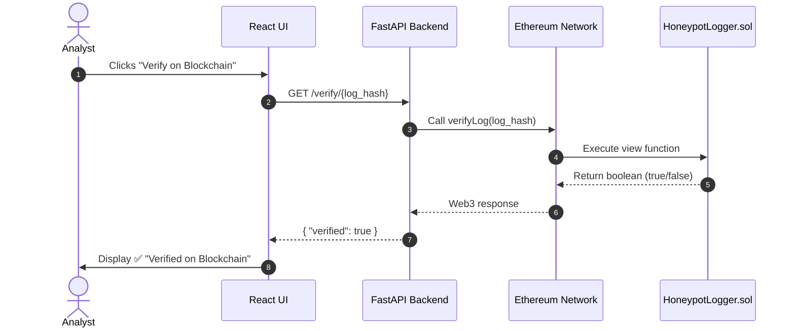

# Enterprise Deceptive Honeypot - Architecture & Sequence Diagrams

This document contains the critical architectural sequence diagrams illustrating the end-to-end data flow within the system.

## 1. End-to-End Attack & Deception Flow

This sequence demonstrates how an attacker's request is trapped, analyzed by the AI engine, logged to the blockchain, and streamed to the React dashboard.

```mermaid
sequenceDiagram
    autonumber
    actor Attacker
    participant Proxy as Gateway Proxy (Port 2222/8080)
    participant Honeypot as Decoy Service (e.g. SSH)
    participant AI as AI Engine (Ollama)
    participant Backend as FastAPI Backend
    participant Blockchain as Ganache (Smart Contract)
    participant Redis as Redis Cache
    participant Dashboard as React UI

    Attacker->>Proxy: Malicious Request (e.g. `ls -la`)
    Proxy->>Honeypot: Route to internal Docker network
    Honeypot->>Backend: Forward raw payload via HTTP POST /api/log
    
    rect rgb(20, 30, 50)
    note right of Backend: Threat Analysis Phase
    Backend->>AI: Classify Intent & Extract MITRE TTPs
    AI-->>Backend: Return Threat Score & Intent
    end

    rect rgb(20, 50, 30)
    note right of Backend: Forensic Anchoring Phase
    Backend->>Backend: Generate SHA-256 Hash of Log
    Backend->>Blockchain: Anchor hash to HoneypotLogger.sol
    Blockchain-->>Backend: Transaction Receipt
    end

    Backend->>Redis: Cache log for fast retrieval
    Backend->>Dashboard: Push update via WebSocket
    Dashboard-->>Attacker: (Optional) Simulated Honey-response
```

## 2. Blockchain Evidence Verification Flow

This sequence demonstrates how a security analyst uses the dashboard to cryptographically verify that an attack log has not been tampered with.

